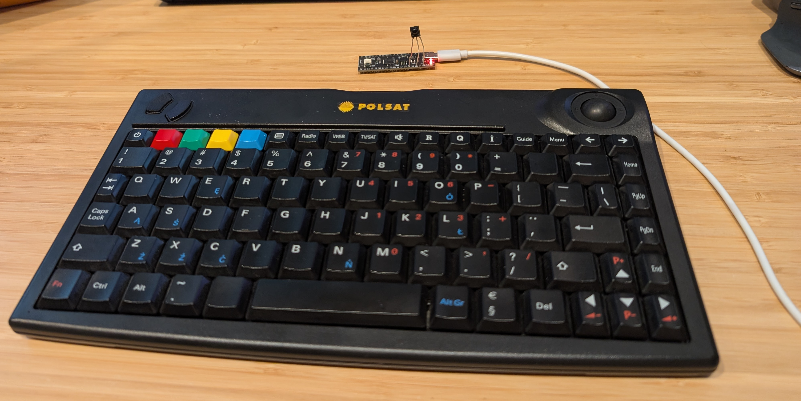

# polsat-ir-receiver

RP2040 IR receiver firmware for Sejin SWK-8695WS IR wireless keyboards. They were white-labeled under multiple brands and distributed with various devices. Most notably they were [sold by Polsat](https://www.youtube.com/watch?v=zWAjH7SizzI) in the early 2000s for use with their email enabled satelite receivers.

## Hardware

A Raspberry Pi Pico and a TSOP2236 36kHz IR receiver is required. The receiver should be connected to GPIO28. The firmware exposes a standard HID mouse and keyboard via USB.

The top row of keys is mapped to Escape and function keys. 

# Flashing

The firmware can be downloaded from the Releases tab, and flashed by holding the BOOT button on the pico while resetting it. The firmware can be dropped to the USB drive.

## License 

MIT
